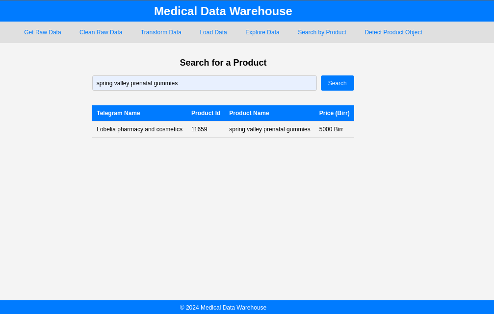

Okay, I will update the `README.md` to reflect the refined project structure, the detailed steps for each task, including the `ml_pipeline` part, the `.env` file usage, and the precise commands we've established.

Here's the updated `README.md` content:

````markdown
# Ethiopian Medical DataWarehouse using YoloV5

A comprehensive data warehouse solution for Ethiopian medical business data scraped from Telegram channels, including data scraping, object detection with YOLOv5, and ETL/ELT processes using dbt, integrated with a FastAPI application for data exposure.

## Screenshot that shows the FastAPI Call



## Project Directory Structure

The repository is organized into the following directories:

- `.github/workflows/`: Contains configurations for GitHub Actions, enabling continuous integration and automated testing.
- `.vscode/`: Configuration files for the Visual Studio Code editor, optimizing the development environment.
- `app/`: Contains the implementation of the FastAPI application, serving RESTful endpoints for data exposure and potentially model inference.
- `data/`: Stores raw data (e.g., from scraping), and processed data for the ML pipeline (images, labels, logs).
- `ethio_medical_dbt_project/`: Your dbt project for data transformation (ETL/ELT).
- `ml_pipeline/`: Contains the scripts and configurations for the YOLOv5 object detection pipeline.
- `notebooks/`: Jupyter notebooks used for tasks such as data exploration, feature engineering, and preliminary modeling.
- `scripts/`: Python scripts for data preprocessing, feature extraction, and utility functions (e.g., scraper, data cleaner, logger).
- `tests/`: Unit tests to ensure the correctness and robustness of the implemented logic.
- `.env`: **Crucial file for environment variables (API keys, database credentials). Not committed to Git.**
- `requirements.txt`: Lists all Python dependencies for the entire project.

## Installation Instructions

To run the project locally, follow these steps:

1.  **Clone the Repository:**

    ```bash
    git clone [https://github.com/epythonlab/EthiomedDataWarehouse.git](https://github.com/epythonlab/EthiomedDataWarehouse.git)
    cd EthiomedDataWarehouse
    ```

2.  **Set up the Virtual Environment:**

    Create a virtual environment to manage the project's dependencies. This is crucial for isolating dependencies.

    **For Windows (PowerShell):**

    ```powershell
    python -m venv .venv
    .\.venv\Scripts\activate
    ```

    **For Linux/macOS (Bash/Zsh):**

    ```bash
    python3 -m venv .venv
    source ./.venv/bin/activate
    ```

3.  **Install Dependencies:**

    Install all required Python packages into your active virtual environment.

    ```bash
    pip install -r requirements.txt
    ```
    *If `pip install -r requirements.txt` fails, try installing packages individually (e.g., `pip install fastapi`, `pip install uvicorn`, `pip install psycopg2-binary`, `pip install roboflow`, etc.).*

4.  **Configure Environment Variables (`.env` file):**

    Create a `.env` file in the **root directory** of your project (`EthiomedDataWarehouse/`). This file will store sensitive credentials and API keys.

    ```
    # .env
    DB_USER=your_postgres_username
    DB_PASSWORD=your_postgres_password
    DB_HOST=localhost
    DB_PORT=5432
    DB_NAME=your_database_name

    TELEGRAM_API_ID=your_telegram_api_id
    TELEGRAM_API_HASH=your_telegram_api_hash

    ROBOFLOW_API_KEY=your_roboflow_dataset_api_key
    # ROBOFLOW_INFERENCE_API_KEY=your_roboflow_inference_api_key # Optional: If using a separate key for inference
    ```
    *Replace placeholder values with your actual credentials and keys.*
    *Ensure this `.env` file is added to your `.gitignore` to prevent it from being committed to version control.*

## Tasks

### Task 1: Scraping and Storing Data from Telegram Channels

This task involves collecting raw data from Telegram and ingesting it into your PostgreSQL database.

1.  **Start PostgreSQL Server:** Ensure your PostgreSQL server is running and accessible.
2.  **Create Database:** Create a database in your PostgreSQL instance (e.g., `your_database_name`) and ensure the `DB_USER` has appropriate permissions.
3.  **Configure Scraper:**
    * Navigate to the `scripts/` directory:
      ```bash
      cd scripts/
      ```
    * Ensure your `TELEGRAM_API_ID` and `TELEGRAM_API_HASH` are set in your project's `.env` file.
    * Run the Telegram scraper:
      ```bash
      python telegram_scraper.py
      ```
4.  **Clean Raw Data:**
    * From the `scripts/` directory:
      ```bash
      python data_cleaner.py
      ```
5.  **Store Data to Database:**
    * From the `scripts/` directory:
      ```bash
      python store_data.py
      ```
    * This script will store the cleaned data into a raw table in your PostgreSQL database (as defined by your `dbt` sources).

### Task 2: Data Transformation using DBT

This task transforms the raw data ingested from Telegram into structured, ready-for-analysis models in your data warehouse.

1.  **Configure DBT Profiles:**
    * Create a `.dbt` directory in your user's home directory (e.g., `C:\Users\YourUser\.dbt\` on Windows, or `~/.dbt/` on Linux/macOS).
    * Create a `profiles.yml` file inside this `.dbt` directory with your PostgreSQL connection details. The `profile` name in `profiles.yml` must match the `profile` specified in `ethio_medical_dbt_project/dbt_project.yml`.

    ```yaml
    # ~/.dbt/profiles.yml (Example for PostgreSQL)
    ethio_medical_profile: # Matches profile in dbt_project.yml
      target: dev
      outputs:
        dev:
          type: postgres
          host: your_postgres_host # e.g., localhost
          user: your_postgres_username
          password: your_postgres_password
          port: 5432
          dbname: your_database_name
          schema: public # Or your dbt schema
          threads: 4
    ```

2.  **Install dbt Packages:**
    * Navigate to your dbt project root:
      ```bash
      cd ethio_medical_dbt_project/
      ```
    * Ensure `dbt-labs/dbt_utils` is listed in `packages.yml` (e.g., `version: 1.1.1`).
    * Install dbt packages:
      ```bash
      dbt deps
      ```

3.  **Run dbt Models:**
    * From `ethio_medical_dbt_project/`:
      ```bash
      dbt run --full-refresh
      ```
      *`--full-refresh` ensures tables are rebuilt from scratch, useful after schema changes.*

4.  **Test and Document dbt Models:**
    * From `ethio_medical_dbt_project/`:
      ```bash
      dbt test
      dbt docs generate
      dbt docs serve # Then open http://localhost:8080 in your browser
      ```

### Task 3: Object Detection using YOLOv5

This task involves preparing image data, training a YOLOv5 model, and running inference.

1.  **Navigate to ML Pipeline:**
    * Go to the `ml_pipeline/` directory:
      ```bash
      cd ml_pipeline/
      ```

2.  **Prepare Data (Download & Split):**
    * Ensure your `ROBOFLOW_API_KEY` is set in the project's `.env` file.
    * This step will clone YOLOv5 (if not present), install its requirements, download the dataset from Roboflow (if `data/photos` is empty), and split images and labels into `train/` and `valid/` directories.
    ```bash
    python main.py
    ```
    *This single command currently orchestrates data preparation, training, prediction, and storing results. You can run individual scripts like `python scripts/prepare_data.py` if needed.*

3.  **Run Training and Prediction:**
    * The `python main.py` command (from step 2) will also handle model training and prediction after data preparation.
    * Training results (weights, logs, plots) will be in `ml_pipeline/yolov5/runs/train/`.
    * Prediction results (detected images, `.txt` labels) will be in `ml_pipeline/yolov5/runs/detect/`.

4.  **Store Detection Results:**
    * This step is part of `python main.py`. Ensure your `scripts/store_detection_results.py` is implemented to read YOLOv5 output `.txt` files and load them into your PostgreSQL database.

### Task 4: FastAPI Integration

This task sets up the web API to serve transformed data and detection results.

1.  **Start FastAPI Application:**
    * Make sure you are in the **root directory** of the entire project (`EthiomedDataWarehouse/`).
    * Activate your virtual environment.
    * Run the Uvicorn server:
      ```bash
      uvicorn app.main:app --reload
      ```
    * *If you encounter persistent environment issues with `--reload` (e.g., `ModuleNotFoundError` despite packages being installed), try without it:*
      ```bash
      uvicorn app.main:app
      ```
      *You can then access the API at `http://127.0.0.1:8000` (or `http://localhost:8000`) in your web browser.*

## Contributing

We welcome contributions to improve the project. Please follow the steps below to contribute:

- Fork the repository.
- Create a new branch for your feature or bugfix.
- Submit a pull request with a detailed explanation of your changes.
````